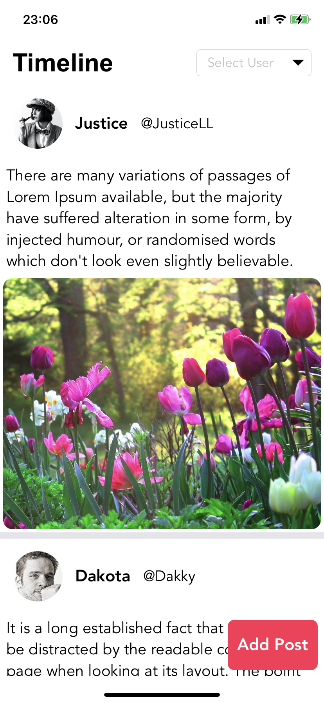
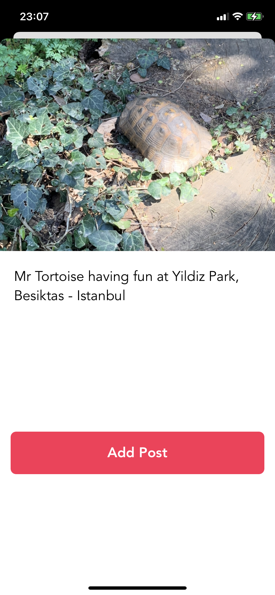

# SSN-Simple-Social-Network

Simple Social Network mock iOS Application to refresh my skills as an iOS developer :)

This project uses MVP architecture and has no database or whatsoever.
UIKit is used instead of relatively new SwiftUI declarative paradigm.
Both posts and users are handled locally.

  
  

